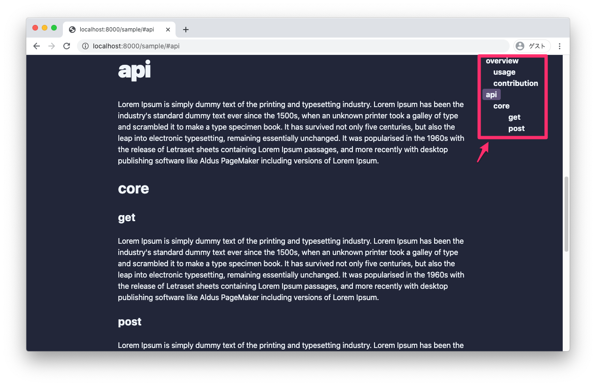
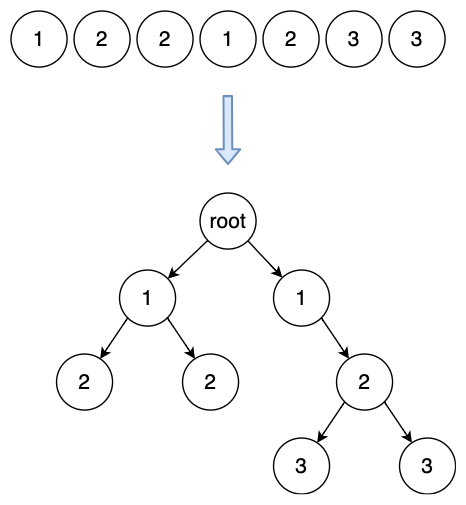

普段、アプリケーションレイヤーのコードを書く機会が多いので、アルゴリズムやプログラムの計算量を意識することはほとんど無いです。  
多重ループは避けたいとか、N+1 問題とか、パフォーマンス低下につながる最低限気をつけなければいけないことは一応知っているつもりですが、雰囲気でしか理解していませんでした。(今も怪しい)

そういった背景から、最低限プログラムの計算量の求め方（O 記法）と簡単なアルゴリズムとその計算量について勉強する機会がありました。  
今回その知識が趣味で書いていたフロントエンドのコードで助けになったのでその話を書きます。

こんな見出し機能を作ることを考えます。



GraphQL から 以下の型で heading タグの情報を得られるとします。

```typescript
{ depth: number, value: string }[]
```

得られた配列を階層構造にする必要があるとします。(UI フレームワークの制約により)
たとえば

```javascript
// GraphQLで取得したデータ構造
input = [
  { depth: 1, "Background" },
  { depth: 2, "Why" },
  { depth: 2, "How" },
  { depth: 1, value: "API" },
  { depth: 2, value: "Core" },
  { depth: 3, value: "GET" },
  { depth: 3, value: "POST" },
]

// UIライブラリにつっこむためのデータ構造
expectedOutput = [
  {
    depth: 1,
    value: "Background",
    children: [
      {
        depth: 2,
        value: "Why",
        children: [],
      },
      {
        depth: 2,
        value: "How",
        children: [],
      },
    ],
  },
  {
    depth: 1,
    value: "API",
    children: [
      {
        depth: 2,
        value: "Core",
        children: [
          {
            depth: 3,
            value: "GET",
            children: [],
          },
          {
            depth: 3,
            value: "POST",
            children: [],
          },
        ],
      },
    ],
  },
]
```

これは一般化すると、深さ情報を持ったノードが並んでいるので木構造に変換してください。という問題に置き換えられると思います。



# ソリューション

## O(n)

最善とは限らないですが、これを選びました。  
for ループで、現在のノード(`input[i]`)と一つ前のノード(`input[i-1]`)の値を比較します。  
もし一つ前のノードの値が小さければそのノードが親です。  
逆に一つ前のノードの値が大きければ現在のノードが新たな親です。  
そうでなければ直近親だったノードが親です。  
このように親を更新しながら比較していけばノードの個数分のループで済むので、計算量は O(n)です。

## O(n^2)

最初に思いついたのがこの方法でしたが、よくありません。  
配列の末端は必ず葉となるので、末端から先端へと各ノードの親を探そうと考えました。  
つまり、あるノードから先端までの配列に親がいるか線形探索、という操作をノード分繰り返します。
O(n)の処理を n 回行うので、計算量は O(n^2)です。

```javascript
const root = []
for (let i = input.lenght - 1; i >= 0; i--) {
  // Linear search
  let j -= i
  while (j >= 0) {
    if (input[i] > input[j]) {
      input[j].children.push(input[i])
      break
    }
    j--
  }
  root.push(input[i])
}
```

### O(n^2)になる理由

実際にこのアルゴリズムのステップ数を求めてみます。

i = 7 のとき 6 回  
i = 6 のとき 5 回  
i = 5 のとき 4 回

...

i = n のとき n - 1 回  
i = n - (n - 1) のとき 1 回  
i = n のとき 0 回

初項 n-1，公差 -1，項数 n の初項から第 n 項までの和を求めればよいです。  
(公式を gg り)合計で(1/2)n^2 - (1/2)n 回と求まります。  
最高次以外と係数はオーダーの違いに比べ影響が少ないため無視できるので、O(n^2)のアルゴリズムとなります。

# コメント

コードを書く時、読みやすさはよく意識すると思います。  
データ構造や計算量の概念があれば自分の書いたコードを評価する基準が増えますし、  
別の解法を思いつきやすくなるのでは無いでしょうか。  
他方で、早さを優先するか読みやすさを優先するかは場合によると思います。  
今回の場合では簡潔で読みやすいコードを選択するべきだと思います。

# 参考

- [データ構造とアルゴリズム](https://www.amazon.co.jp/dp/4901683497)
