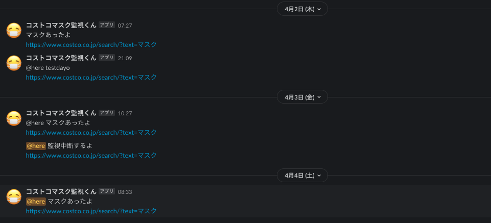
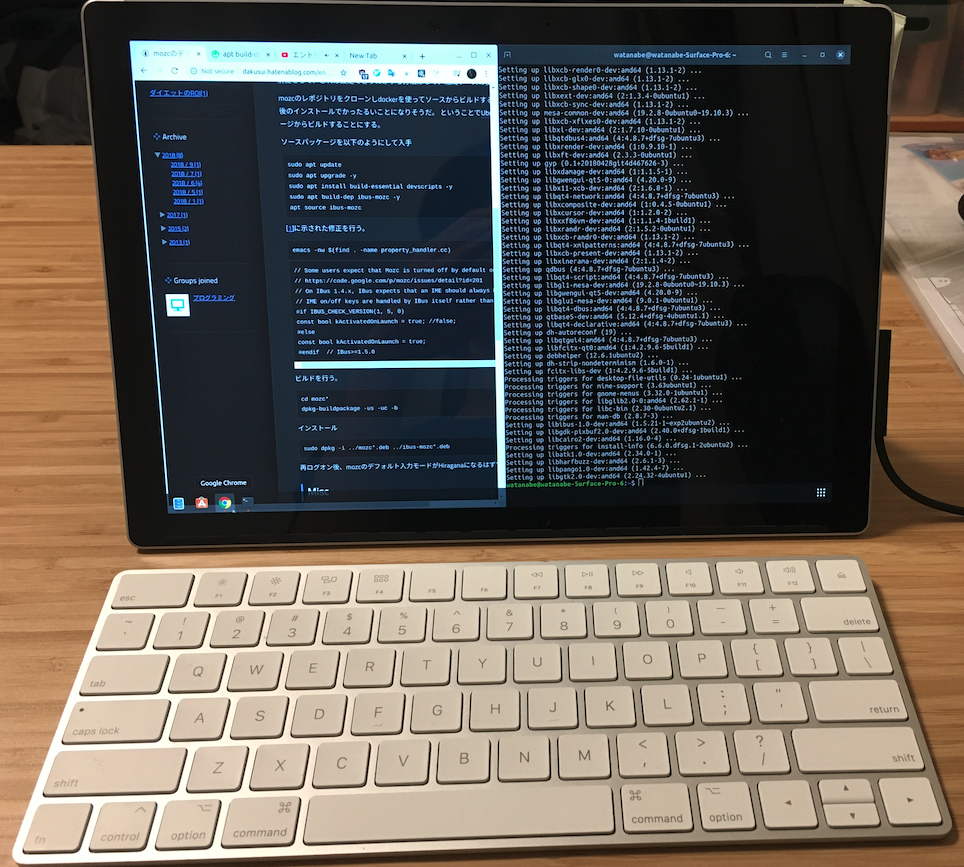

import { graphql } from "gatsby"
import { Embed, Divider, Link, Text } from "theme-ui"
import { BiCodeAlt } from "react-icons/bi"

import DefaultMDXLayout from "../../components/mdx-layout"
import enhanceChromeHistoryDemo from "./enhance-chrome-history-demo.gif"
import holdemAdviserDemo from "./holdem-adviser-demo.gif"
import CodeLink from "../../components/code-link"

export const pageQuery = graphql`
  query MDXQuery {
    mdx(frontmatter: { title: { eq: "demo" } }) {
      tableOfContents
    }
  }
`

export default DefaultMDXLayout

趣味で作ったプログラムの紹介です

# Blog

<CodeLink to="https://github.com/wtnb93/blog" />

このブログです
Gatsby.js, MDX を使ってみました

# Enhance Chrome History Search

<CodeLink to="https://github.com/wtnb93/enhance-chrome-history-search" />

Chrome の履歴検索を強化する拡張機です
あらゆる Web ページに独自の UI を追加する必要があったので ShadowDOM を使いカプセル化しました

# Simple Webtracker

<CodeLink to="https://github.com/wtnb93/simple-webtracker" />

手軽に EC サイトの在庫確認をしたくて作成しました
GCE の無料枠で動かしていましたが、結局通知に気づけなかったので 3 日で停止しました

# Keybind configuration

UbuntuDesktop のキーボードショートカットを MacOS 風に変更するために頑張りました

<CodeLink to="https://github.com/wtnb93/keybind-configuration" />

# HoldemAdviser

<CodeLink to="https://github.com/wtnb93/holdemAdviser" />

ポーカーの学習支援ゲームです

