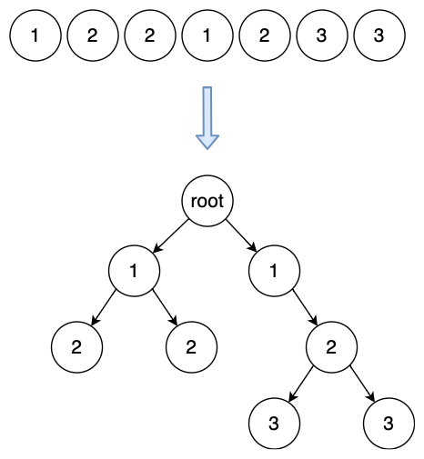
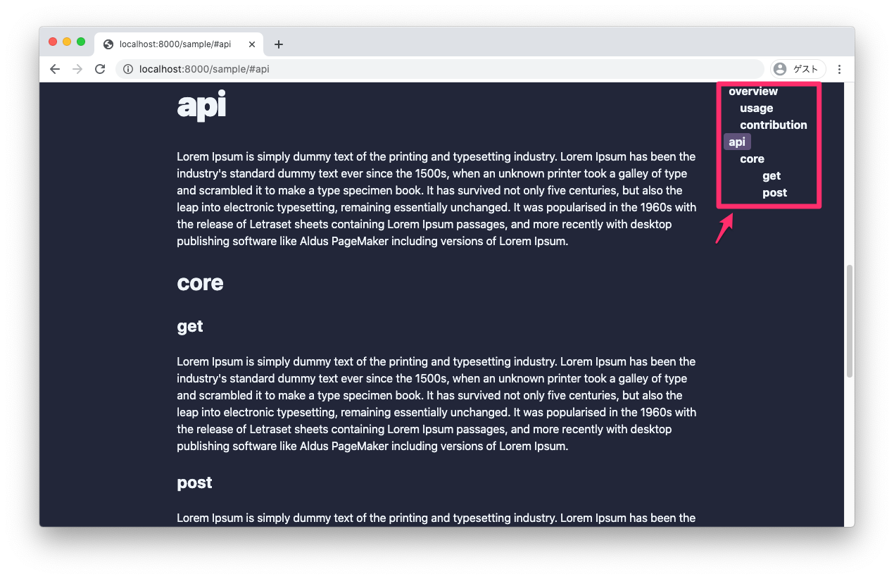

# 概要
ソフトウェア開発者にとって、アルゴリズムと計算量の概念はしばしば役に立ちます。  
この記事では、もっとも基本的なアルゴリズムと計算量の求め方で、深さ情報を持ったノードが並んだ配列から木構造を作成するときの計算量について考えます。  
※筆者はジュニアエンジニアなので誤った情報の可能性が大いにあります。



```javascript
// In code
input = [{ depth: 1 }, { depth: 2 }, { depth: 2 }, { depth: 1 }, { depth: 2 }, { depth: 3 }, { depth: 3 }]

expect_output = [
  {
    depth: 1,
    children: [
      {
        depth: 2,
        children: []
      },
      {
        depth: 2,
        children: []
      },
    ],
  },
  {
    depth: 1,
    children: [
      {
        depth: 2,
        children: [
          {
            depth: 3,
            children: [],
          },
          {
            depth: 3,
            children: []
          },
        ],
      },
    ],
  },
]
```

inputの配列には以下の制約があります。
- 親ノードは常に子ノードの手前に来ます。  
- 親は以下の条件で決まります。
  - 自身より値が小さい
  - 自身より手間に存在する
  - 自身に最も近い


# 背景
この問題が生まれた背景について書きます。このセクションは重要ではありません。  
結論はこのブログに目次を実装するためです。  




## inputはheadingタグの情報
このBlogはGatsbyで構築しており、MarkdownファイルをHTMLに変換し記事ページを作成します。  
HTMLへの変換時にheadingタグにidを振ります。  
最終的に全てのheadingタグ情報を次の型で取得します。  
```typescript
{ depth: number, value: string }[]
```

## outputの階層構造はライブラリの制約
[AntDesign](https://ant.design/components/tree/) のTreeコンポーネントを使用したくて、
階層構造にする必要がありました。

# ソリューション

## O(n)
このソリューションがおそらく最速で簡単です。(最善とは限らないです。)  
forループで、現在のノード(`input[i]`)と一つ前のノード(`input[i-1]`)の値を比較します。  
もし一つ前のノードの値が小さければそのノードが親です。  
逆に一つ前のノードの値が大きければ現在のノードが新たな親です。  
そうでなければ直近親だったノードが親です。  
このように親を更新しながら比較していけばノードの個数分のループで済むので、計算量はO(n)です。


## O(n^2)
最初に思いついたのがこのソリューションでしたが、よくありません。  
配列の末端は必ず葉となるので、末端から先端へと各ノードの親を探そうと考えました。  
つまり、あるノードから先端までの配列に親がいるか線形探索、という操作をノード分繰り返します。
O(n)の処理をn回行うので、計算量はO(n^2)です。

```javascript
// In code
for (let i = input.lenght - 1; i >= 0; i--) {
  // Linear search
  let j -= i
  while (j >= 0) {
    if (input[i] > input[j]) {
      input[j].children.push(input[i])
      break
    }
    j--
  }
  root.push(input[i])
}
```

### O(n^2)になる理由
もしO記法による計算量について馴染みが薄い場合、このアルゴリズムはO(n^2)よりも小さく、nの定数倍のように思えるかもしれません。(私がそうでした。)  
ループが回るごとに親を探すステップは減っていくためです。  
なので実際にこのアルゴリズムのステップ数を求めてみます。  

i = 7 のとき 6回  
i = 6 のとき 5回  
i = 5 のとき 4回  

...

i = n のとき n - 1回  
i = n - (n - 1) のとき 1回  
i = n のとき 0回  

初項 n-1，公差 -1，項数 n の初項から第 n 項までの和を求めればよいです。  
(公式をggり)合計で(1/2)n^2 - (1/2)n回と求まります。  
最高次以外と係数はオーダーの違いに比べ影響が少ないため無視できるので、O(n^2)のアルゴリズムとなります。  

# コメント
コードを書く時、読みやすさはよく意識すると思います。  
データ構造や計算量の概念があれば自分の書いたコードを評価する基準が増えますし、  
別の解法を思いつきやすくなるのでは無いでしょうか。  
他方で、早さを優先するか読みやすさを優先するかは場合によると思います。  
今回の場合では簡潔で読みやすいコードを選択するべきだと思います。

# 参考
- [データ構造とアルゴリズム](https://www.amazon.co.jp/dp/4901683497)
- [Introduction to Big O Notation and Time Complexity (Data Structures & Algorithms #7)
](https://www.youtube.com/watch?v=D6xkbGLQesk)
- [If Programming Was An Anime
](https://www.youtube.com/watch?v=pKO9UjSeLew)